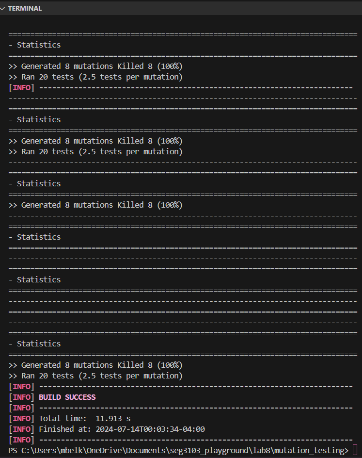
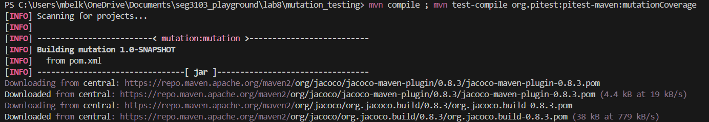
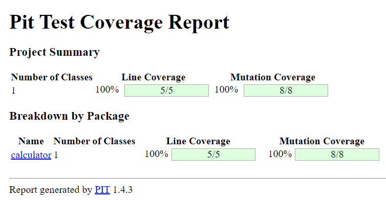
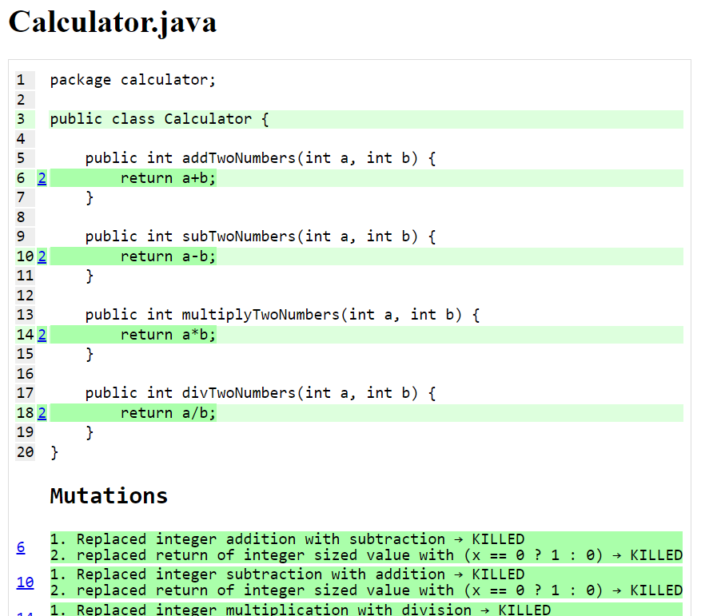

**Screenshots:**

**In your own words explain what the various mutations are doing and what
the report tells you:**

In mutation testing, various mutations alter your codebase to simulate potential errors or faults, such as swapping operators (like addition with subtraction), changing method calls, modifying return values, or altering conditional statements. These mutations are designed to test the effectiveness of your test suite by introducing these potential errors and checking if your tests can detect and report them.

**Explain what it means for a mutant to be killed:**

When a mutant is killed, it means that one of these mutated versions of your code is detected as faulty by your test suite during testing. This detection typically results in a failed test case or an error, indicating that your tests have successfully identified and flagged the introduced error. This process confirms that your tests are robust enough to catch specific types of programming mistakes or changes introduced by the mutations, thereby enhancing the reliability of your software.
